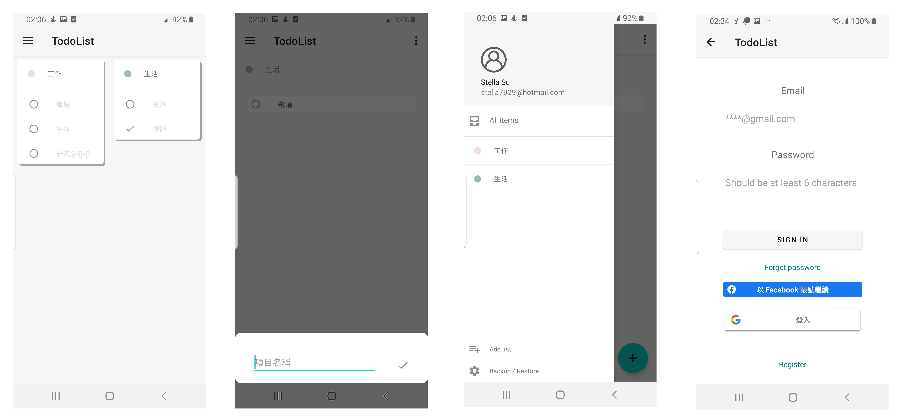

# Todolist
###### This is my practice android application.

- [x] Add to-do item via floating action button.
- [x] Can set to-do items category.
- [x] Preview all to-do items.
- [x] Offer Google, Facebook, and email account sign-in.
- [x] Can backup and restore mission data after sign-in.
- [x] Auto-sync remote data after sign-in.

## Images

## Links

You can download test version [here](https://drive.google.com/file/d/1vT_-cz5EI8yG8k3a-abkZHTfTNjjlctr/view?usp=sharing).
